<center><h1>Projet IoT — Système de gestion d'éclairage connecté</h1></center>

## Présentation

Ce projet met en œuvre une infrastructure IoT complète autour d'un système d'éclairage intelligent. Un objet connecté (Arduino Uno R4 WiFi) mesure la lumière ambiante et ajuste en continu la température de couleur et la luminosité d'une LED en fonction de son environnement. Il communique via un réseau ZigBee (réseau LTN, faible débit) avec une passerelle USB, qui transmet les données à une stack de visualisation déployée en Docker (Node-RED, InfluxDB, Grafana).

Le projet couvre l'ensemble de la chaîne IoT : acquisition de données sur un objet embarqué contraint, transport sur un réseau sans fil à faible consommation, ingestion en base de données de séries temporelles, et visualisation sur tableau de bord. Il inclut également une réflexion sur la sécurité de l'infrastructure.

## Sommaire

- [Diagnostic et cadrage](#diagnostic-et-cadrage)
    - [Résumé exécutif](#résumé-exécutif)
    - [Observation & problème observable](#observation--problème-observable)
    - [Besoins fonctionnels (SMART)](#besoins-fonctionnels-smart)
    - [Contraintes & hypothèses](#contraintes--hypothèses)
    - [Benchmark d'architectures (Cloud / Edge / Hybride)](#benchmark-darchitectures-cloud--edge--hybride)
    - [Comparatif techno communication (LTN/LPWAN vs courte-portée)](#comparatif-techno-communication-ltnlpwan-vs-courte-portée)
    - [Risques initiaux & mesures](#risques-initiaux--mesures)
    - [Synthèse & pré-choix](#synthèse--pré-choix)
- [Choix et modélisation de la technologie de communication](#choix-et-modélisation-de-la-technologie-de-communication)
    - [Choix de la technologie](#choix-de-la-technologie)
    - [Sécurité de la solution](#sécurité-de-la-solution)
    - [Schéma d’architecture de communication](#schéma-darchitecture-de-communication)
- [Vue d'ensemble de l'architecture](#vue-densemble-de-larchitecture)
- [Arborescence du projet](#arborescence-du-projet)
- [Description détaillée des composants](#description-détaillée-des-composants)
    - [EdgeDeviceController — Objet connecté](#edgedevicecontroller--objet-connecté)
        - [Matériel requis](#matériel-requis)
        - [Bibliothèques utilisées](#bibliothèques-utilisées)
        - [Logique applicative](#logique-applicative)
    - [ZigBeeUSBSimulator — Coordinateur / Passerelle](#zigbeeusbsimulator--coordinateur--passerelle)
        - [Fonctionnement](#fonctionnement)
    - [Protocole de communication — Cloud sur ZigBee](#protocole-de-communication--cloud-sur-zigbee)
        - [Format des messages](#format-des-messages)
        - [Topics utilisés](#topics-utilisés)
        - [Analogie avec MQTT](#analogie-avec-mqtt)
    - [Dashboard — Stack Docker](#dashboard--stack-docker)
        - [Services déployés](#services-déployés)
        - [Configuration](#configuration)
    - [ColorSettingsTester — Outil de calibration LED](#colorsettingstester--outil-de-calibration-led)
- [Technologies utilisées](#technologies-utilisées)
    - [Réseaux et communication](#réseaux-et-communication)
        - [ZigBee — Réseau LTN (Low Throughput Network)](#zigbee--réseau-ltn-low-throughput-network)
        - [Protocoles de communication IoT](#protocoles-de-communication-iot)
    - [Matériel](#matériel)
    - [Outillage logiciel](#outillage-logiciel)
- [Prérequis](#prérequis)
    - [Matériel](#matériel)
    - [Logiciel](#logiciel)
- [Installation et utilisation](#installation-et-utilisation)
    - [Configuration des modules XBee](#configuration-des-modules-xbee)
    - [Téléversement des firmwares](#téléversement-des-firmwares)
    - [Lancement du Dashboard](#lancement-du-dashboard)
    - [Chaîne de données complète](#chaîne-de-données-complète)
- [Sécurité et considérations IoT](#sécurité-et-considérations-iot)
    - [État actuel](#état-actuel)
    - [Améliorations envisagées pour renforcer la sécurité](#améliorations-envisagées-pour-renforcer-la-sécurité)
- [Résultats (montage et captures d'écran)](#résultats-montage-et-captures-décran)
    - [Montage du prototype](#montage-du-prototype)
    - [Node-RED](#node-red)
    - [InfluxDB](#influxdb)
    - [Grafana](#grafana)
- [Perspectives d'amélioration](#perspectives-damélioration)
    - [Réglage de la luminosité et de la température de couleur](#réglage-de-la-luminosité-et-de-la-température-de-couleur)
    - [Sécurité](#sécurité)
- [Références](#références)

## Diagnostic et cadrage

### Résumé exécutif

**Problème observable** :

Consommation excessive des éclairages au CESI et limitation de la morosité en hiver en en période de pluie.

**Besoins fonctionnels (SMART)** :

- **Specific** :
  Le projet concerne le CESI dans la démarche durable. Actuellement, l’environnement est un sujet important dans le développement d’une institution. De ce fait, il est légitime d’essayer de réduire la consommation énergétique du bâtiment notamment en réduisant la dépendance électrique en limitant l’éclairage. De plus, l’hiver et les temps de pluie sont connus pour provoquer un sentiment général de morosité. Nous pouvons faire varier la température de la lumière pour aider à améliorer l’humeur ambiante.

- **Measurable** :
  Nous pouvons mesurer l’indice lumineux à l’aide d’un capteur lumineux. Nous pouvons mesurer la réussite du projet avec la variation de luminosité d’une LED RGB. L’évolution d’économie d’énergie peut-être également observée avec une interface.

- **Achievable** :
  Notre projet est entièrement réalisable à l’aide des équipements mis à disposition du CESI.

- **Relevant** :
  Notre projet permet de réduire la consommation d’énergie dû à l’éclairage des salles / couloirs du CESI. Nous utilisons des technologies IoT afin de faire communiquer notre capteur et les LED.

- **Time-based** :
  Notre projet est réalisable en 3 semaines avec le découpage suivant : - 1ère semaine : Cas d’étude, - 2ème semaine : Modélisation des technologies, - 3ème semaine : Implémentation du prototype.

- **Contraintes clés** :
    - Énergie (réduction de la consommation d’énergie des luminaires),
    - Longue portée

- **Pré-choix d’architecture** : Cloud ; nous avons besoin de traiter les informations relevées par les capteurs de luminosité dans un serveur centralisé afin de faciliter l’agrégation de différentes sources comme d’autres capteurs (luminosité, température ou autre) ou des API (météo).

### Observation & problème observable

**Contexte/zone** :

Le projet s’applique au bâtiment du CESI, en particulier aux couloirs, salles de cours et espaces communs où l’éclairage reste fréquemment actif même lorsque la lumière naturelle est suffisante. Ces zones sont très utilisées durant les horaires de cours (environ 6h - 20h pour compter les cours mais aussi les services de maintenance du site), avec une fréquentation variable selon les créneaux (arrivées le matin, pause déjeuner, sorties en fin de journée).

Les couloirs et certaines salles disposent de fenêtres, mais l’éclairage artificiel est souvent allumé de manière constante sans prise en compte de la luminosité extérieure (ensoleillement, pluie, hiver).

**Faits mesurables** :

L’éclairage des couloirs et salles est souvent allumé en continu durant la journée, indépendamment de la luminosité naturelle disponible.

Les conditions météorologiques (pluie, ciel couvert, hiver) entraînent une baisse notable de la luminosité ambiante, nécessitant parfois un éclairage complémentaire.

Une salle de classe nécessite environ 300 lux (norme EN 12464-1) pour garantir un confort visuel adapté au travail.

La luminosité naturelle peut varier fortement dans une même journée (matin / midi / soir) et selon la météo, entraînant une surconsommation lorsque l’éclairage reste constant.

Une mesure en temps réel via capteur permettrait d’observer ces variations et d’adapter automatiquement l’intensité lumineuse nécessaire.

**Problème formulé** :

Comment ajuster automatiquement l’éclairage artificiel dans les salles et couloirs du CESI en fonction de la luminosité naturelle afin de maintenir un confort visuel optimal tout en réduisant la consommation énergétique et en limitant la morosité liée aux périodes hivernales et pluvieuses ?

**Bénéficiaires / personas** :

Étudiants / Enseignants / Personnel CESI / Visiteurs : Amélioration du confort visuel et de l’ambiance générale dans les salles et couloirs. Réduction des coûts énergétiques et optimisation de la gestion des équipements.

**Indicateurs de succès (KPI)** :

Δ kWh

### Besoins fonctionnels (SMART)

**B1 (besoin usager – confort visuel)** :

Le système doit garantir un niveau de luminosité conforme aux normes d’usage dans les salles et couloirs du CESI en maintenant une luminosité moyenne cible de 300 lux (± 20 lux) dans une salle de cours, et 150 lux (± 20 lux) dans un couloir, durant les périodes d’occupation.

**B2 (besoin usager – ambiance / morosité)** :

Le système doit permettre d’adapter la température de couleur de l’éclairage (ex : lumière froide/blanche ou chaude) en fonction des conditions extérieures (météo, saison ou luminosité ambiante) afin d’améliorer le confort ressenti des usagers, avec une variation visible sur l’éclairage (LED RGB).

**B3 (besoin gestionnaire – réduction de consommation)** :

Le système doit réduire la consommation énergétique liée à l’éclairage en ajustant automatiquement l’intensité lumineuse selon la lumière naturelle, avec un objectif de réduction mesurable d’au moins 10% sur une période d’expérimentation, tout en conservant le niveau de confort visuel.

### Contraintes & hypothèses

**Latence / criticité locale** :

La latence n’est pas un problème, nous ne travaillerons pas en temps-réel mais avec une mesure toute les minutes environ. De plus, la quantité de données transférées ne risque pas de provoquer de la latence.

**Énergie / autonomie** :

Le dispositif doit pouvoir fonctionner sans interruption et doit être économe en énergie comme notre projet l’impose. Pour cela, on peut alimenter notre prototype en utilisant le secteur ou une pile/batterie. Dans les deux cas, un travail d’optimisation de la consommation sera nécessaire.

**Réseau / couverture** :

Comme dit précédent, le réseau n’a pas besoin d’être rapide, cependant, le dispositif doit pouvoir être étendu sur l’ensemble du bâtiment.

**Critères** :

**Interopérabilité** :

La communication avec le Cloud sera indépendante ce qui veut dire que si le Cloud cesse de fonctionner, la carte restera basée sur les dernières données envoyées par le Cloud.

**Sécurité (baseline)** :

Les données transférées ne sont pas sensibles donc une sécurité minimale telle que l’authentification WPA2-Personal du WiFi est suffisante.

### Benchmark d'architectures (Cloud / Edge / Hybride)

| Option      | Schéma rapide                                                                                                                      | Latence     | Sobriété                                                                                           | Simplicité           | Limites                                               | Go / No-Go                                  |
| ----------- | ---------------------------------------------------------------------------------------------------------------------------------- | ----------- | -------------------------------------------------------------------------------------------------- | -------------------- | ----------------------------------------------------- | ------------------------------------------- |
| **Cloud**   | Capteur → [filaire] Carte → [ZigBee] Cloud (traitement/affichage) → [ZigBee] Carte → [filaire] LED                                 | Moyenne     | Consommation plus importante à cause des transferts de données                                     | Dépend du serveur    | Interférences<br>Consommation<br>Dépendance au réseau | **No-Go** (surdimensionnement)              |
| **Edge**    | Capteur → [filaire] Carte (traitement) → [filaire] LED<br>Carte → [ZigBee/Wi-Fi] Cloud (affichage)<br>Cloud → [ZigBee/Wi-Fi] Carte | Très faible | Très faible consommation                                                                           | Très simple          | Isolement des systèmes                                | **Go** (prototype capteur + LED uniquement) |
| **Hybride** | Capteur → [filaire] Carte (calculs) → [filaire] LED<br>Capteur → [filaire] Carte → Serveur (échange d’informations)                | Faible      | Consommation moyenne à cause des transferts de données (moins que Cloud car autonomie de la carte) | Un peu plus complexe | Complexité et coût de mise en place                   | **Go** (inclut un service home assistance)  |

**Analyse & choix provisoire** :

Choix prévisionnel : Architecture Hybride

**Analyse** :

L’ajout d’un Dashboard ainsi que de l’utilisation d’une API météo dans notre projet nous oblige à utiliser une architecture hybride. Notre capteur pourra directement communiquer avec notre la carte qui influera sur la LED (Partie Edge), notre carte pourra recevoir des données depuis un serveur Cloud (commandes utilisateurs / API météo) et en envoyer notamment pour le Dashboard (Partie Cloud).

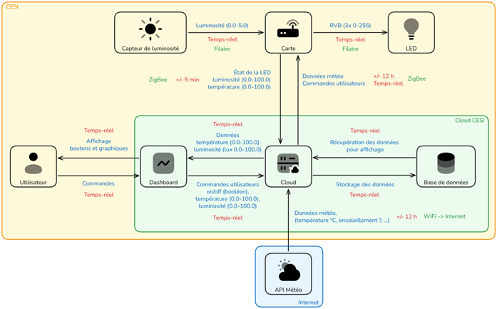

### Comparatif techno communication (LTN/LPWAN vs courte-portée)

| Famille       | Exemples | Portée  | Débit      | Conso       | Coût/infra | Remarques - cas d’usage                                  |
| ------------- | -------- | ------- | ---------- | ----------- | ---------- | -------------------------------------------------------- |
| LPWAN         | LoRaWAN  | ± 10 km | ± 50 kbps  | Très faible | 0€         | Usage à l’échelle d’une ville / campus / champs          |
| Courte-portée | ZigBee   | ± 100 m | ± 250 kbps | Faible      | 0€         | Usage en environnement clos (maison, bureaux, bâtiments) |

**Conclusion multicritère** :

Une technologie de communication à grande échelle n’étant pas nécessaire pour notre projet, nous avons décidé de nous orienter vers une communication ZigBee qui combine une faible consommation d’énergie et un débit très suffisant pour notre projet.

### Risques initiaux & mesures

**Techniques** :

- **Interférences** :

    Probables interférences avec le chevauchement de la bande WiFi par ZigBee. La totalité (100%) des packets n’est pas obligatoire car nous allons faire des moyennes par tranches de 5 minutes.

- **Cloud** :

    Le cloud peut se déconnecter car il va dépendre du WiFi. La solution pourra fonctionner en autonomie elle conservera les dernières informations de météo enregistrées.

- **Capteur** :

    Le capteur pourrait être défectueux et renvoyer des données aberrantes ou incorrectes. Dans ce cas, l’intensité lumineuse sera basée sur la moyenne recommandé (300 lux).

- **Sécurité** :

    Sécurité des communication AES-128 (protocole ZigBee), authentification au Dashboard (username/password)

- **Opérationnels** :

    En cas de panne / crash du système, les lumières des salles resteront opérationnelles à l’aide des interrupteurs dans les salles mais il n’y aura plus de variations de luminosité.

### Synthèse & pré-choix

**Architecture retenue (provisoire)** :

Architecture Hybride avec Dashboard en cloud

**Famille techno pressentie** :

- Capteur de luminosité : BH1750 ou équivalent (mesure en lux).
- Microcontrôleur IoT : ESP32
- Communication : MQTT.
- Plateforme Cloud : serveur MQTT + base de données + dashboard
- Actionneur : LED RGB

**Exigences sécurité minimales** :

- Authentification obligatoire pour l’accès au dashboard et au serveur.
- Communication sécurisée (au minimum identifiants MQTT + mot de passe, idéalement TLS).
- Contrôle des droits d’accès (capteurs en écriture uniquement, dashboard en lecture/administration).
- Protection contre les commandes non autorisées (validation des messages reçus).
- Données stockées de manière privée (pas d’accès public au broker ou à l’interface).

**Schéma de principe** :


---

## Choix et modélisation de la technologie de communication

### Choix de la technologie

Notre solution peut être intégrée à un système domotique présentant les caractéristiques suivantes :

- Faible portée
- Faible débit
- Faible consommation énergétique
- Indépendance vis-à-vis d’un opérateur privé

La technologie ZigBee apparaît donc comme la plus appropriée, malgré sa portée limitée. Ce manque peut toutefois être compensé grâce à l’utilisation d’un réseau maillé (mesh), qui étend efficacement la couverture.

### Sécurité de la solution

Pour sécuriser notre solution, nous souhaitons mettre en place le système d’authentification de ZigBee (le protocole intègre cette fonctionnalité par défaut). De plus, comme les données seront utilisés pour déclencher des actions, nous pensons qu’il faut ajouter une couche de sécurité supplémentaire en encryptant les données. Un algorithme simple suffira.

### Schéma d’architecture de communication

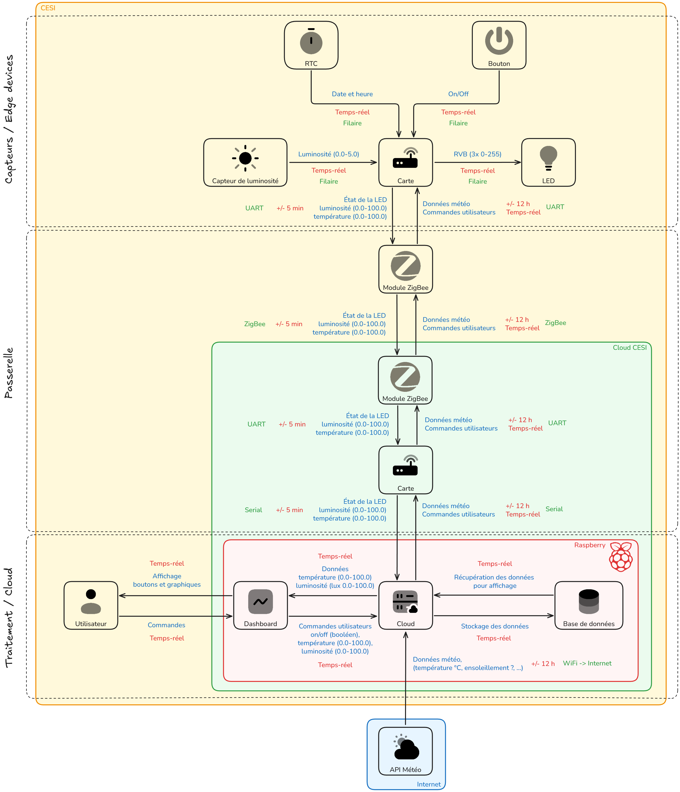

## Vue d'ensemble de l'architecture

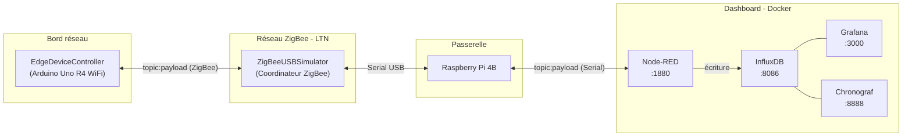

### Rôle de chaque brique

| Composant                | Rôle                                                                                                                                                                                                         |
| ------------------------ | ------------------------------------------------------------------------------------------------------------------------------------------------------------------------------------------------------------ |
| **EdgeDeviceController** | Objet connecté en bordure : lit le capteur de lumière, pilote la LED ChainableLED, synchronise l'horloge RTC, et publie la télémétrie toutes les 10 secondes via ZigBee                                      |
| **Réseau ZigBee**        | Liaison sans fil à faible débit (LTN) entre l'objet et la passerelle ; protocole pub/sub encodé en `topic:payload` dans chaque trame ZigBee                                                                  |
| **ZigBeeUSBSimulator**   | Coordinateur ZigBee branché en USB sur le PC hôte ; reçoit les trames des objets et les affiche sur le port série ; accepte aussi des commandes saisies en `topic;payload` pour les rediffuser sur le réseau |
| **Node-RED**             | Orchestrateur de flux : lit le port série du coordinateur, parse les données, les écrit dans InfluxDB ; peut aussi servir de pont vers MQTT ou CoAP                                                          |
| **InfluxDB**             | Base de données de séries temporelles ; stocke les relevés (horodatage, température couleur LED, luminosité, capteur)                                                                                        |
| **Grafana**              | Tableau de bord de visualisation ; se connecte à InfluxDB pour afficher courbes et métriques                                                                                                                 |
| **Chronograf**           | Interface d'exploration et d'administration d'InfluxDB                                                                                                                                                       |

## Arborescence du projet

```
CESI_A4_IoT/
├── README.md                          ← ce fichier
├── Packages/
│   ├── EdgeDeviceController/          ← Firmware objet connecté
│   │   ├── platformio.ini             ← Configuration PlatformIO (Uno R4 WiFi, libs)
│   │   ├── src/
│   │   │   ├── main.cpp               ← Point d'entrée : setup/loop, abonnements Cloud
│   │   │   ├── lightService.cpp       ← Logique d'adaptation de la LED
│   │   │   └── lib/
│   │   │       ├── zigBee.cpp         ← Driver ZigBee + classe Cloud (pub/sub)
│   │   │       ├── led.cpp            ← Contrôle ChainableLED
│   │   │       ├── clock.cpp          ← RTC DS1307 + classe Datetime
│   │   │       ├── lightSensor.cpp    ← Lecture capteur analogique (A0)
│   │   │       ├── switchButton.cpp   ← Gestion bouton avec debounce
│   │   │       └── debug.cpp          ← Utilitaires de débogage série
│   │   ├── include/
│   │   │   ├── constants.h            ← Toutes les constantes matérielles
│   │   │   ├── main.h                 ← Includes globaux
│   │   │   ├── lightService.h
│   │   │   ├── lib/                   ← En-têtes des drivers
│   │   │   └── utils/
│   │   │       └── float.h / float.cpp ← Utilitaires float (mapFloat, ulltoa)
│   │   └── lib/                       ← Dossier bibliothèques PlatformIO
│   │
│   ├── ZigBeeUSBSimulator/            ← Firmware coordinateur ZigBee
│   │   ├── platformio.ini             ← Configuration PlatformIO (Uno R4 WiFi, xbee-arduino)
│   │   ├── README.md                  ← Documentation détaillée du coordinateur
│   │   ├── src/
│   │   │   ├── main.cpp               ← Point d'entrée coordinateur + bridge Serial
│   │   │   └── lib/
│   │   │       └── zigBee.cpp         ← Même driver ZigBee/Cloud que EdgeDeviceController
│   │   └── include/
│   │       ├── constants.h
│   │       └── lib/zigBee.h
│   │
│   ├── Dashboard/                     ← Stack Docker de collecte et visualisation
│   │   ├── docker-compose.yml         ← Composition : Node-RED, InfluxDB, Chronograf, Grafana
│   │   ├── .env                       ← Identifiants InfluxDB et Grafana
│   │   ├── nodered-storage/           ← Données persistantes Node-RED (flows, settings)
│   │   │   └── settings.js            ← Configuration runtime Node-RED
│   │   ├── grafana-provisioning/
│   │   │   ├── datasources/
│   │   │   │   └── datasource.yml     ← InfluxDB comme source de données par défaut
│   │   │   └── dashboards/
│   │   │       ├── dashboard.yml      ← Fournisseur de dashboards (dossier /provisioning)
│   │   │       └── artillery.json.example ← Exemple de dashboard Grafana
│   │   ├── influxdb-storage/          ← Volume de données InfluxDB
│   │   ├── chronograf-storage/        ← Volume de données Chronograf
│   │   └── grafana-storage/           ← Volume de données Grafana (grafana.db)
│   │
│   └── ColorSettingsTester/           ← Outil auxiliaire de calibration LED
│       ├── RGBCalculator.html         ← Calculateur interactif température/luminosité
│       └── RGBCalculator.ggb          ← Source GeoGebra du calculateur
│
└── Screenshots/                       ← Captures d'écran du projet
```

## Description détaillée des composants

### EdgeDeviceController — Objet connecté

**Fichiers principaux :**

- [`Packages/EdgeDeviceController/src/main.cpp`](Packages/EdgeDeviceController/src/main.cpp)
- [`Packages/EdgeDeviceController/include/constants.h`](Packages/EdgeDeviceController/include/constants.h)
- [`Packages/EdgeDeviceController/include/lib/zigBee.h`](Packages/EdgeDeviceController/include/lib/zigBee.h)

#### Matériel requis

| Composant                                   | Broche / Interface      | Rôle                                        |
| ------------------------------------------- | ----------------------- | ------------------------------------------- |
| Arduino Uno R4 WiFi (Renesas)               | —                       | Microcontrôleur principal                   |
| Module XBee (série S2C)                     | UART2 (RX2/TX2)         | Communication ZigBee                        |
| RTC DS1307                                  | I2C                     | Horloge temps réel                          |
| Capteur de luminosité (LDR/phototransistor) | `A0`                    | Mesure du niveau de lumière ambiante        |
| LED ChainableLED (Grove)                    | `D4` (CLK), `D5` (DATA) | LED RGB pilotée en température de couleur   |
| Bouton marche/arrêt                         | `D2` (OFF), `D3` (ON)   | Activation/désactivation du service lumière |

La configuration complète des broches est centralisée dans [`constants.h`](Packages/EdgeDeviceController/include/constants.h) :

```cpp
#define ZIGBEE_RX_PIN     UART2_RX_PIN
#define ZIGBEE_TX_PIN     UART2_TX_PIN
#define ZIGBEE_PAN_ID     "666"
#define ZIGBEE_CHANNELS   "D5E3"   // canaux 11-26
#define BUTTON_OFF_PIN    D2
#define BUTTON_ON_PIN     D3
#define LIGHT_SENSOR_PIN  A0
#define LED_CLK_PIN       D4
#define LED_DATA_PIN      D5
```

#### Bibliothèques utilisées

Déclarées dans [`platformio.ini`](Packages/EdgeDeviceController/platformio.ini) :

| Bibliothèque   | Source                                                                | Rôle                                |
| -------------- | --------------------------------------------------------------------- | ----------------------------------- |
| `xbee-arduino` | [andrewrapp/xbee-arduino](https://github.com/andrewrapp/xbee-arduino) | Driver bas niveau XBee (API mode 2) |
| `ChainableLED` | [pjpmarques/ChainableLED](https://github.com/pjpmarques/ChainableLED) | Pilotage des LED Grove chainables   |
| `RTC_DS1307`   | [0xybo/RTC_DS1307](https://github.com/0xybo/RTC_DS1307)               | Lecture/écriture de l'horloge RTC   |

#### Logique applicative

Le firmware suit une boucle à 10 ms avec un compteur d'index cyclique (0–1000) :

```
setup()
 ├── Initialisation Serial (9600 baud)
 ├── Clock::setup()          ← démarrage RTC DS1307
 ├── Led::setup()            ← initialisation ChainableLED
 ├── SwitchButton::setup()   ← configuration boutons avec debounce
 ├── ZigBee::setup()         ← configuration XBee en API mode 2, PAN 666
 ├── Cloud::setup()
 ├── Cloud::subscribe("iot/settings", …)   ← réception horodatage Unix → sync RTC
 └── Cloud::subscribe("iot/weather", …)    ← réception paramètres météo → LED

loop()  (toutes les 10 ms)
 ├── SwitchButton::loop()    ← lecture boutons, activation/désactivation LED
 ├── LightService::loop()    ← ajustement LED selon capteur lumière
 ├── ZigBee::loop()          ← lecture des trames ZigBee entrantes
 ├── Cloud::loop()
 └── (toutes les 10 s) → si configuré : Cloud::publish("iot/stats", …)
                          sinon        : Cloud::publish("iot/ask_settings", "")
```

**Service lumière (LightService) :** Le service adapte en continu la LED à la lumière ambiante. La luminosité cible est l'inverse du niveau de lumière (plus il fait sombre, plus la LED est lumineuse), et la température de couleur suit le niveau lumineux. La transition est lissée par un filtre passe-bas (coefficient 0,02) pour éviter les changements brusques.

```
luminosité LED cible  = 100 - niveau_capteur     (contrainte : 20–80 %)
température LED cible = niveau_capteur            (contrainte : 20–80 %)
valeur_suivante       = valeur_courante + (cible - valeur_courante) × 0,02
```

### ZigBeeUSBSimulator — Coordinateur / Passerelle

**Fichiers principaux :**

- [`Packages/ZigBeeUSBSimulator/src/main.cpp`](Packages/ZigBeeUSBSimulator/src/main.cpp)
- [`Packages/ZigBeeUSBSimulator/README.md`](Packages/ZigBeeUSBSimulator/README.md) ← documentation détaillée

Ce firmware transforme une deuxième carte Arduino Uno R4 WiFi en **coordinateur ZigBee** branché en USB sur le PC hôte. Il joue le rôle de pont bidirectionnel entre le réseau ZigBee et le PC (Node-RED, script Python, terminal…).

#### Fonctionnement

**Sens objet → PC (réception) :**

Lorsqu'une trame arrive du réseau ZigBee, le coordinateur l'affiche sur le port série selon le format :

```
iot/stats;<adresse64bits>;<payload>
iot/ask_settings;<adresse64bits>;
```

**Sens PC → objet (émission) :**

La saisie d'une commande dans le moniteur série au format `topic;payload` (terminée par `\n`) provoque la publication de la trame `topic:payload` sur le réseau ZigBee en broadcast :

```
iot/settings;1741234567        → publie iot/settings:1741234567
iot/weather;1;2                → publie iot/weather:1;2
```

**Bibliothèque utilisée :** uniquement `xbee-arduino` (voir [`platformio.ini`](Packages/ZigBeeUSBSimulator/platformio.ini)).

### Protocole de communication — Cloud sur ZigBee

Le projet implémente un protocole de messagerie **pub/sub minimaliste** directement dans le payload des trames ZigBee, sans couche MQTT ou CoAP. Ce choix est délibéré dans le cadre pédagogique pour comprendre les mécanismes fondamentaux avant d'utiliser une couche protocolaire standard.

#### Format des messages

```
Dans la trame ZigBee  : topic:payload
Sur le port série     : topic;payload   (entrée coordinateur)
                        topic;<addr>;<payload>   (sortie coordinateur)
```

La classe `Cloud` (dans `zigBee.h` / `zigBee.cpp`) encapsule ce mécanisme :

- `Cloud::publish(topic, payload)` → concatène `topic:payload` et envoie en broadcast ZigBee
- `Cloud::subscribe(topic, callback)` → enregistre un callback déclenché à la réception du topic
- `Cloud::deliver(sender, payload, length)` → parsé depuis `ZigBee::handleRxPacket`, distribue aux abonnés

#### Topics utilisés

| Topic              | Direction     | Format payload                                      | Rôle                                   |
| ------------------ | ------------- | --------------------------------------------------- | -------------------------------------- |
| `iot/settings`     | Cloud → Objet | `<timestamp_unix>`                                  | Synchronisation de l'horloge RTC       |
| `iot/weather`      | Cloud → Objet | `<matin>;<apres-midi>`                              | Paramètres de luminosité selon l'heure |
| `iot/stats`        | Objet → Cloud | `<timestamp>;<temp_couleur>;<luminosité>;<capteur>` | Télémétrie toutes les 10 s             |
| `iot/ask_settings` | Objet → Cloud | _(vide)_                                            | Demande de configuration initiale      |

**Exemple de trame `iot/stats` :**

```
iot/stats:1741234567;42;65;78
          ↑timestamp  ↑LED temp (%) ↑LED bright (%) ↑capteur lumière (%)
```

#### Analogie avec MQTT

| MQTT                     | Ce projet                                 |
| ------------------------ | ----------------------------------------- |
| Broker MQTT              | Broadcast ZigBee (pas de point central)   |
| `PUBLISH topic payload`  | `Cloud::publish("iot/stats", "…")`        |
| `SUBSCRIBE topic`        | `Cloud::subscribe("iot/stats", callback)` |
| QoS 0 (fire & forget)    | Pas d'accusé de réception applicatif      |
| Payload binaire ou texte | Payload texte délimité par `;`            |

La principale différence : MQTT centralise les messages sur un broker ; ici, le broadcast ZigBee joue ce rôle de diffusion, sans garantie d'ordre ni de livraison.

### Dashboard — Stack Docker

**Fichier de composition :** [`Packages/Dashboard/docker-compose.yml`](Packages/Dashboard/docker-compose.yml)

#### Services déployés

| Service        | Image Docker              | Port               | Rôle                                                                 |
| -------------- | ------------------------- | ------------------ | -------------------------------------------------------------------- |
| **Node-RED**   | `nodered/node-red:latest` | `1880`             | Orchestrateur de flux : connexion Serial, parsing, écriture InfluxDB |
| **InfluxDB**   | `influxdb:latest`         | `8086`             | Base de données de séries temporelles (base `db0`)                   |
| **Chronograf** | `chronograf:latest`       | `8888` (localhost) | Interface d'exploration et d'administration InfluxDB                 |
| **Grafana**    | `grafana/grafana:latest`  | `3000`             | Tableau de bord de visualisation                                     |

Les données sont persistées dans des volumes locaux (`influxdb-storage/`, `chronograf-storage/`, `grafana-storage/`, `nodered-storage/`).

#### Configuration

Les identifiants sont définis dans [`Packages/Dashboard/.env`](Packages/Dashboard/.env) :

```env
INFLUXDB_USERNAME=admin
INFLUXDB_PASSWORD=admin
GRAFANA_USERNAME=admin
GRAFANA_PASSWORD=admin
```

> **Important :** modifier ces identifiants avant tout déploiement en environnement non-isolé.

**Provisionnement automatique de Grafana :**

Au démarrage, Grafana charge automatiquement :

- La source de données InfluxDB → [`grafana-provisioning/datasources/datasource.yml`](Packages/Dashboard/grafana-provisioning/datasources/datasource.yml)
- Les dashboards JSON déposés dans → [`grafana-provisioning/dashboards/`](Packages/Dashboard/grafana-provisioning/dashboards/) (exemple fourni : `artillery.json.example`)

**Flux de données attendu dans Node-RED :**

```
[Serial In (coordinateur)] → [Function: parser "iot/stats;<addr>;<data>"]
                           → [Split ";" → timestamp, temp, brightness, sensor]
                           → [InfluxDB Out (base db0, measurement "lumière")]
```

> Le dépôt ne contient pas de flows Node-RED préconfigurés. Ils sont à créer dans l'interface Node-RED selon l'usage (monitoring, alertes, etc.).

### ColorSettingsTester — Outil de calibration LED

**Fichiers :** [`Packages/ColorSettingsTester/RGBCalculator.html`](Packages/ColorSettingsTester/RGBCalculator.html), `RGBCalculator.ggb`

Outil HTML autonome (ouvrir dans un navigateur) permettant de visualiser en temps réel la couleur produite par une LED en fonction de :

- La **température de couleur** (en Kelvin, de 2500 K chaud à 6500 K froid)
- La **luminosité** (en %, de 0 à 100)

Il affiche les composantes R, G, B résultantes et un spectrum de couleurs avec curseurs. Cet outil a servi à définir et calibrer l'algorithme de conversion utilisé dans la classe `Led` de l'EdgeDeviceController.

## Technologies utilisées

### Réseaux et communication

#### ZigBee — Réseau LTN (Low Throughput Network)

ZigBee est un protocole de communication sans fil basé sur le standard IEEE 802.15.4, conçu pour les réseaux de capteurs à faible consommation d'énergie. Il fait partie de la famille des **LTN (Low Throughput Network)** et des **LPWAN** courte portée.

| Caractéristique | Valeur                             |
| --------------- | ---------------------------------- |
| Fréquence       | 2,4 GHz (mondial)                  |
| Débit           | 250 kbps maximum                   |
| Portée          | 10–100 m (intérieur)               |
| Topologie       | Maillage (mesh), étoile, arbre     |
| Consommation    | Très faible (sleep modes)          |
| Adressage       | 64 bits (IEEE) + 16 bits (réseau)  |
| PAN ID          | Identifiant de réseau (ici :`666`) |

Dans ce projet, ZigBee est utilisé en **API mode 2** (échappement des octets spéciaux) via la bibliothèque `xbee-arduino`. Le réseau est configuré en topologie broadcast : l'objet diffuse ses données vers tous les nœuds, le coordinateur reçoit et retransmet.

**Comparaison dans la taxonomie LTN/LPWAN :**

| Technologie  | Portée | Débit       | Consommation | Cas d'usage typique           |
| ------------ | ------ | ----------- | ------------ | ----------------------------- |
| ZigBee       | ~100 m | 250 kbps    | Très faible  | Domotique, capteurs intérieur |
| LoRa/LoRaWAN | ~10 km | 0,3–50 kbps | Très faible  | Smart city, agriculture       |
| Sigfox       | ~40 km | 100–600 bps | Très faible  | Compteurs, trackers           |
| NB-IoT       | ~10 km | ~60 kbps    | Faible       | Smart metering, mobilité      |
| Wi-Fi        | ~50 m  | 54–600 Mbps | Élevée       | Passerelles, caméras          |

#### Protocoles de communication IoT

**MQTT (Message Queuing Telemetry Transport) :**
Protocole de messagerie pub/sub léger basé sur TCP/IP, standard de facto pour l'IoT. Un broker central (ex. Mosquitto, HiveMQ) redistribue les messages aux abonnés. Contrairement au projet, MQTT offre plusieurs niveaux de QoS (0, 1, 2) et une gestion des sessions persistantes. Il serait naturellement intégrable dans ce projet via Node-RED (nœud MQTT in/out).

**CoAP (Constrained Application Protocol) :**
Protocole de type REST sur UDP, conçu pour les objets très contraints (RFC 7252). Adapté quand l'objet doit exposer des ressources (GET/POST/PUT) à la demande plutôt que publier en continu. Node-RED dispose de nœuds CoAP permettant d'étendre ce projet.

**Ce projet :** protocole pub/sub minimaliste encodé dans le payload ZigBee, sans broker, sans QoS, sans reconnexion automatique. Choix pertinent pour illustrer les fondamentaux et les contraintes d'un réseau LTN embarqué.

### Matériel

| Composant               | Spécification                                                                                      |
| ----------------------- | -------------------------------------------------------------------------------------------------- |
| **Arduino Uno R4 WiFi** | MCU Renesas RA4M1 (ARM Cortex-M4, 48 MHz, 32 KB RAM, 256 KB Flash), WiFi intégré (non utilisé ici) |
| **Module XBee**         | Série S2C ZigBee, firmware coordinateur ou routeur, API mode 2                                     |
| **RTC DS1307**          | Horloge temps réel I2C, précision ±2 s/jour, sauvegarde sur pile CR2032                            |
| **LED ChainableLED**    | LED RGB Grove (P9813), protocole série propriétaire 2 fils (CLK/DATA)                              |
| **Capteur de lumière**  | LDR ou phototransistor sur entrée analogique A0                                                    |

### Outillage logiciel

| Outil                       | Rôle                                                                               |
| --------------------------- | ---------------------------------------------------------------------------------- |
| **PlatformIO** (VS Code)    | Compilation, téléversement, moniteur série pour les firmwares Arduino              |
| **Docker / Docker Compose** | Déploiement de la stack de visualisation (Node-RED, InfluxDB, Grafana, Chronograf) |
| **XCTU** (Digi)             | Configuration des modules XBee (PAN ID, API mode, canal)                           |

## Prérequis

### Matériel

- 2 × Arduino Uno R4 WiFi
- 2 × modules XBee ZigBee (S2C recommandé) + shields ou câblage
- 1 × RTC DS1307 (module breakout)
- 1 × capteur de lumière analogique
- 1 × LED ChainableLED Grove (P9813)
- 2 × boutons poussoirs
- Câbles, breadboard ou PCB

### Logiciel

- [PlatformIO](https://platformio.org/) (extension VS Code ou CLI)
- [Docker Desktop](https://www.docker.com/products/docker-desktop/) (Windows/macOS) ou Docker Engine (Linux)
- [XCTU](https://hub.digi.com/support/products/xctu/) pour configurer les modules XBee

## Installation et utilisation

### 1. Configuration des modules XBee

Avant le premier déploiement, configurer les deux modules XBee avec XCTU :

**Coordinateur (branché sur ZigBeeUSBSimulator) :**

```
ATID 666     ← PAN ID identique sur tous les nœuds
ATAP 2       ← API mode 2 (échappement d'octets)
ATCE 1       ← rôle Coordinateur
ATWR         ← sauvegarder en mémoire flash
```

**Routeur/End Device (branché sur EdgeDeviceController) :**

```
ATID 666
ATAP 2
ATCE 0       ← rôle Routeur ou End Device
ATWR
```

### 2. Téléversement des firmwares

Ouvrir chaque projet dans VS Code avec PlatformIO, brancher la carte concernée, puis :

```bash
# Firmware objet connecté
cd Packages/EdgeDeviceController
pio run --target upload

# Firmware coordinateur ZigBee
cd Packages/ZigBeeUSBSimulator
pio run --target upload
```

L'environnement `uno_r4_wifi` est défini dans `platformio.ini`. Si plusieurs ports série sont présents, ajouter `upload_port = COMx` (Windows) ou `upload_port = /dev/ttyUSBx` (Linux) dans `platformio.ini`.

### 3. Lancement du Dashboard

```bash
cd Packages/Dashboard

# Vérifier / modifier les identifiants
cat .env

# Démarrer la stack
docker compose up -d

# Vérifier que tous les services sont actifs
docker compose ps
```

Accès aux interfaces :

| Service      | URL                                            |
| ------------ | ---------------------------------------------- |
| Node-RED     | [http://localhost:1880](http://localhost:1880) |
| Grafana      | [http://localhost:3000](http://localhost:3000) |
| InfluxDB API | [http://localhost:8086](http://localhost:8086) |
| Chronograf   | [http://localhost:8888](http://localhost:8888) |

### 4. Chaîne de données complète

**Étape 1 — Vérifier la communication ZigBee**

Brancher le coordinateur (ZigBeeUSBSimulator) en USB, ouvrir le moniteur série (9600 baud). Mettre sous tension l'EdgeDeviceController. Après quelques secondes, des messages `iot/ask_settings;<addr>;` apparaissent : le device demande sa configuration.

**Étape 2 — Envoyer la configuration au device**

Dans le moniteur série du coordinateur, saisir (suivi de Entrée) :

```
iot/settings;1741234567
```

_(remplacer par le timestamp Unix courant)_

Ensuite, optionnellement envoyer les paramètres météo :

```
iot/weather;1;2
```

Le device répond ensuite avec des trames `iot/stats` toutes les 10 secondes.

**Étape 3 — Configurer Node-RED**

Dans l'interface Node-RED ([http://localhost:1880](http://localhost:1880)) :

1. Ajouter un nœud **Serial In** pointant vers le port COM du coordinateur (9600 baud)
2. Ajouter un nœud **Function** pour parser la trame `iot/stats;<addr>;<ts>;<temp>;<bright>;<sensor>`
3. Ajouter un nœud **InfluxDB Out** (base `db0`, measurement `lumiere`)
4. Déployer le flow

**Étape 4 — Visualiser dans Grafana**

Se connecter à Grafana, créer un dashboard pointant sur la source de données InfluxDB (déjà provisionnée), et construire les panels (courbes température couleur, luminosité, niveau capteur).

## Sécurité et considérations IoT

### État actuel

| Aspect                 | Situation actuelle                   | Risque                                                               |
| ---------------------- | ------------------------------------ | -------------------------------------------------------------------- |
| Chiffrement ZigBee     | Désactivé                            | Les trames sont lisibles par tout récepteur ZigBee sur le même canal |
| PAN ID                 | Valeur par défaut (`666`)            | Facilement devinable ; tout coordinateur peut rejoindre le réseau    |
| Authentification       | Aucune                               | N'importe quel émetteur ZigBee peut publier des topics               |
| Identifiants Dashboard | `admin/admin` par défaut dans `.env` | Accès non autorisé si le Dashboard est exposé sur le réseau          |
| Données en transit     | Texte clair                          | Timestamp, niveaux de lumière, état LED lisibles en clair            |

### Améliorations envisagées pour renforcer la sécurité

**Réseau ZigBee :**

- Activer le chiffrement ZigBee (clé réseau 128 bits via ATKY dans XCTU)
- Changer le PAN ID par une valeur aléatoire non triviale
- Limiter les canaux de scan (`ZIGBEE_CHANNELS` dans `constants.h`)

**Dashboard :**

- Modifier les identifiants dans `.env` avant toute mise en production
- Ne pas exposer les ports InfluxDB (8086) et Chronograf (8888) sur un réseau public
- Configurer HTTPS sur Grafana et Node-RED pour les déploiements hors localhost

**Objet connecté :**

- Valider le format des payloads reçus avant de les appliquer (pas de validation actuellement sur `iot/settings` et `iot/weather`)
- Implémenter un mécanisme de liste blanche des adresses autorisées (adresse 64 bits de l'émetteur disponible dans le callback)

## Résultats (montage et captures d'écran)

### Montage du prototype

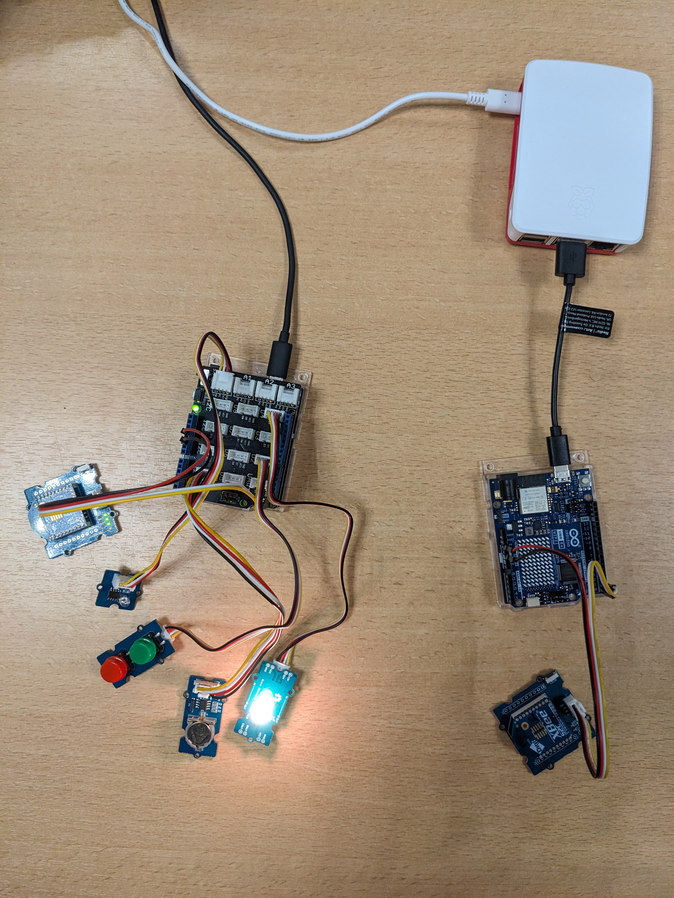

### Node-RED

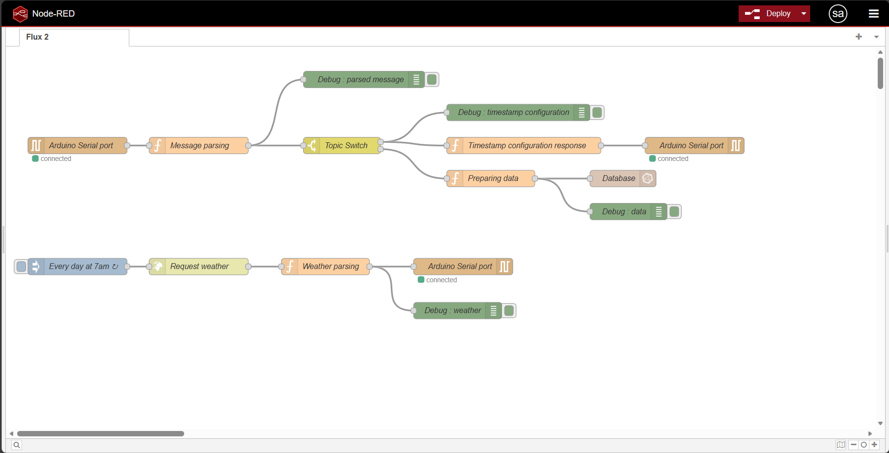

"Topic Switch" : nœud de fonction pour parser les trames série du coordinateur et router selon le topic (`iot/stats`, `iot/ask_settings`, etc.)
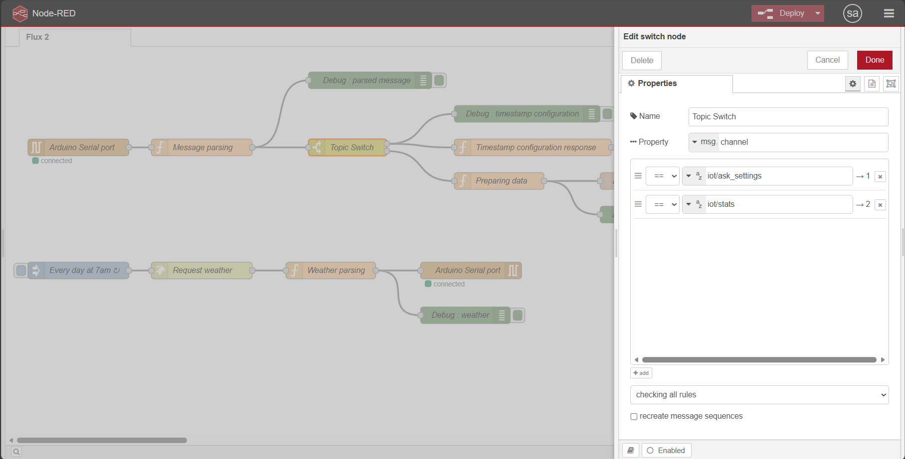

"Timestamp configuration response" : nœud de fonction pour récupérer le timestamp du raspberry et le publier sur le coordinateur (topic `iot/settings`) pour synchroniser l'horloge RTC du device
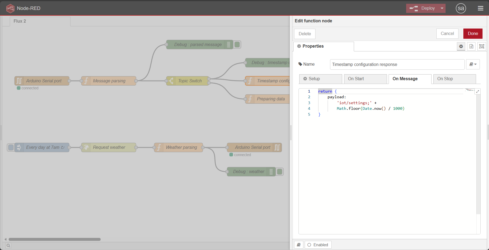

"Weather parsing" : nœud de fonction pour parser les données météo reçues de l'API et les publier sur le coordinateur (topic `iot/weather`) pour ajuster la LED selon les recommandations d'éclairage (température de couleur et luminosité)
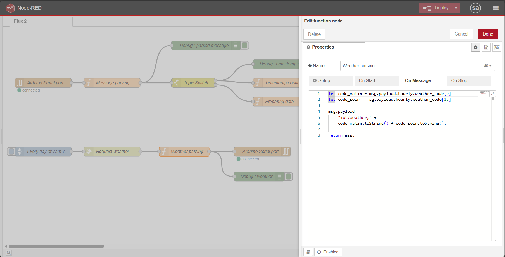

### InfluxDB

Retour de la commande `SELECT * FROM sensorv2 LIMIT 20` dans le CLI d'InfluxDB, montrant les relevés de télémétrie reçus du device (timestamp, luminosité de la LED, luminosité ambiante et température de la LED)
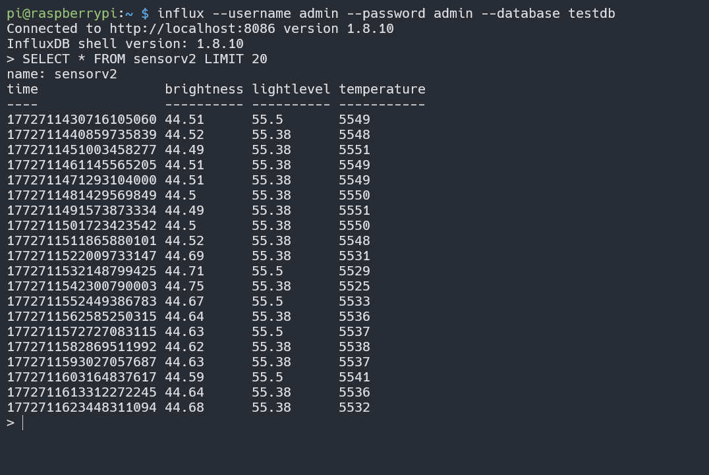

### Grafana

Dashboard pour visualiser les données de luminosité et température de couleur de la LED, ainsi que le niveau du capteur de lumière ambiante, avec des graphiques temporels et des indicateurs de moyenne sur les **5 dernières minutes**
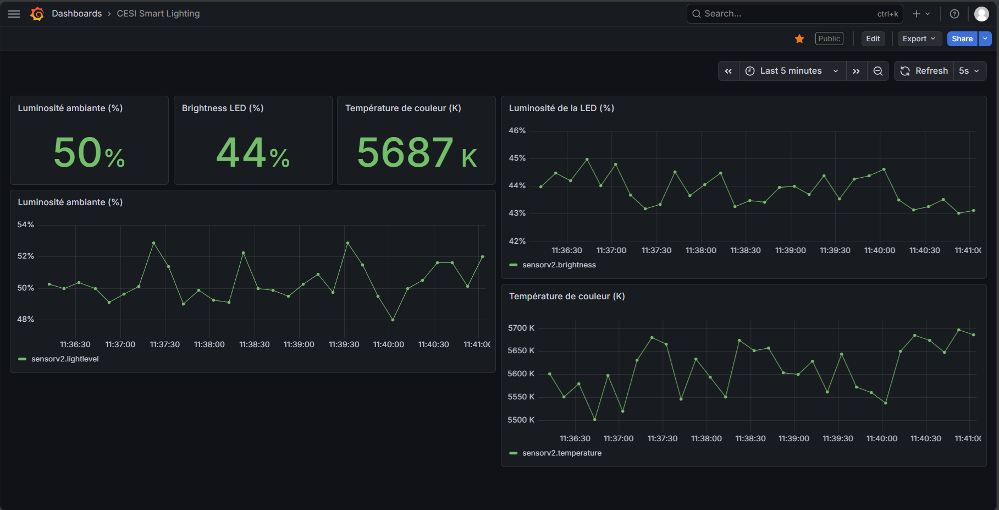

Dashboard pour visualiser les données de luminosité et température de couleur de la LED, ainsi que le niveau du capteur de lumière ambiante, avec des graphiques temporels et des indicateurs de moyenne sur les **6 dernières heures**
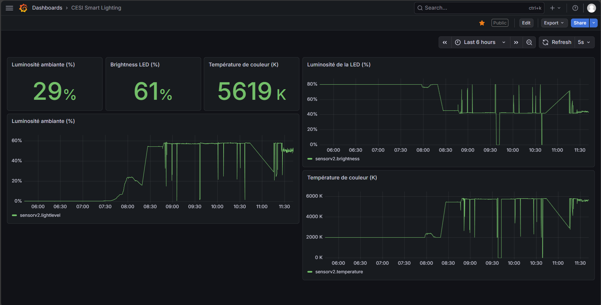

Dashboard pour visualiser les données de luminosité et température de couleur de la LED, ainsi que le niveau du capteur de lumière ambiante, avec des graphiques temporels et des indicateurs de moyenne sur les **période donnée correspondante au levé du soleil**
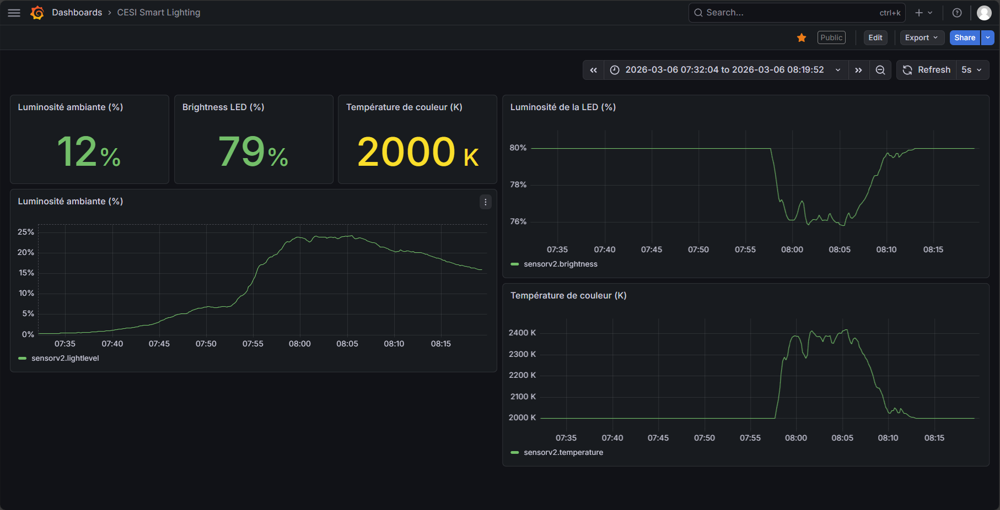

## Perspectives envisagées pour le projet

### Réglage de la luminosité et de la température de couleur

Actuellement le réglage de la luminosité en fonction de la luminosité ambiante est très simple (fonction inverse pour la luminosité et fonction identité pour la température), cependant cette configuration ne correspond pas forcément à une expérience utilisateur optimale. En effet, il est recommandé d'avoir une luminosité de 500 lux pour les bureaux et de 300 lux pour les salles de réunion, cependant la fonction actuelle ne permet pas d'atteindre ces recommandations. Il serait donc intéressant d'ajuster la fonction de réglage de la luminosité pour qu'elle corresponde mieux à ces recommandations.

De plus, nous n'avons pas pu intégrer la prise en compte de la couverture nuageuse dans le paramétrage de la LED, il est donc à ajouter.

Pour faire évoluer ces fonctions, nous avions commencé à développer des outils pour calculer des valeurs de rouge, vert et bleu en fonction du paramétrage (`RGBCalculator.html`) et pour voir l'impact d'une fonction particulière sur le calcul de la luminosité et de la température de la LED.

Outil de cacul RGB
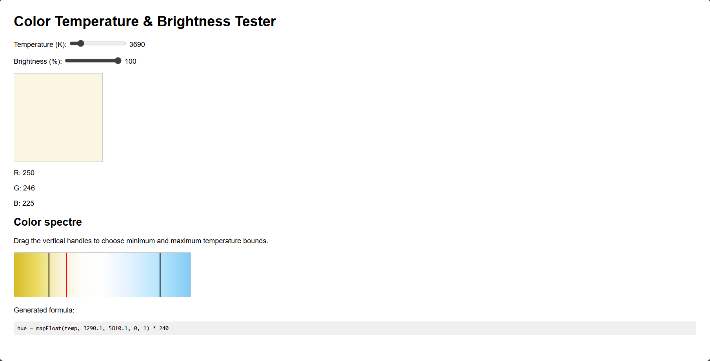

Outil de suivi de l'impact d'une fonction de réglage de la luminosité et de la température
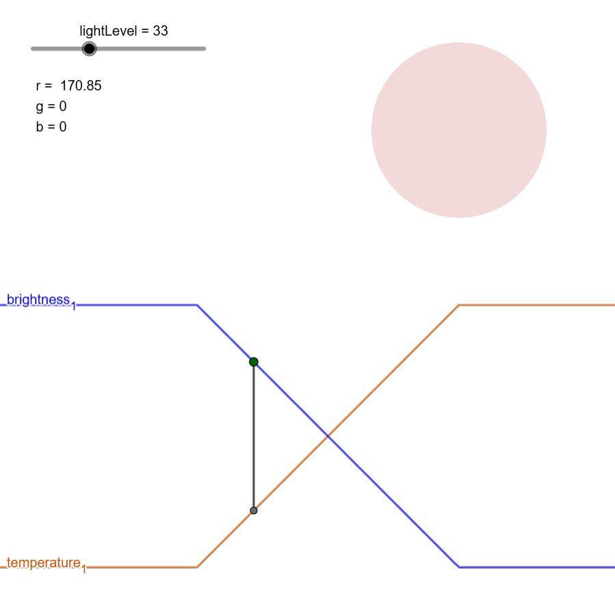
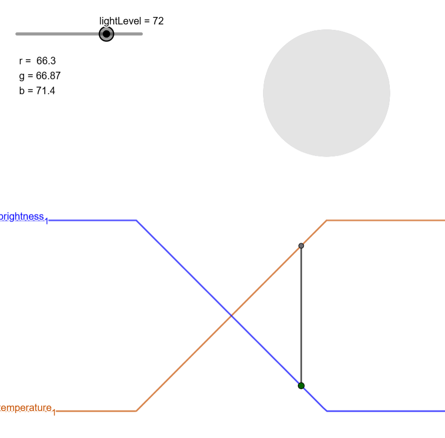

### Sécurité

Comme évoqué dans la section "Sécurité et considérations IoT", le projet actuel présente plusieurs vulnérabilités (chiffrement désactivé, identifiants par défaut, etc.). Il serait pertinent d'implémenter les améliorations proposées pour renforcer la sécurité du réseau ZigBee et du Dashboard, notamment en activant le chiffrement ZigBee, en changeant les identifiants par défaut, et en validant les payloads reçus.

## Références

- [xbee-arduino](https://github.com/andrewrapp/xbee-arduino) — Driver Arduino pour modules XBee
- [ChainableLED](https://github.com/pjpmarques/ChainableLED) — Bibliothèque pour LED Grove chainables
- [RTC_DS1307](https://github.com/0xybo/RTC_DS1307) — Bibliothèque RTC DS1307 pour Arduino
- [PlatformIO](https://platformio.org/docs) — Documentation PlatformIO
- [Node-RED](https://nodered.org/docs/) — Documentation Node-RED
- [InfluxDB 1.x](https://docs.influxdata.com/influxdb/v1/) — Documentation InfluxDB
- [Grafana](https://grafana.com/docs/) — Documentation Grafana
- [ZigBee Specification](https://zigbeealliance.org/) — Standard ZigBee Alliance
- [MQTT v3.1.1](https://docs.oasis-open.org/mqtt/mqtt/v3.1.1/mqtt-v3.1.1.html) — Spécification OASIS MQTT
- [CoAP RFC 7252](https://www.rfc-editor.org/rfc/rfc7252) — Protocole CoAP
- [CIE, Lighting of Indoor Work Places, 2019.](https://files.cie.co.at/x046_2019/x046-OP56.pdf) — Recommandations d'éclairage pour les lieux de travail intérieurs
- [AFNOR NF EN 12464-1, Light and lighting – Indoor workplaces, 2011.](https://www.boutique.afnor.org/fr-fr/norme/nf-en-124641/lumiere-et-eclairage-eclairage-des-lieux-de-travail-partie-1-lieux-de-trava/fa187536/276724) — Norme d'éclairage des lieux de travail intérieurs
- [OASIS, MQTT Version 3.1.1, 2014.](https://docs.oasis-open.org/mqtt/mqtt/v3.1.1/os/mqtt-v3.1.1-os.html) — Spécification MQTT
- [Espressif Systems, ESP32 Technical Reference Manual, 2020.](https://www.espressif.com/sites/default/files/documentation/esp32_technical_reference_manual_en.pdf) — Référence technique du microcontrôleur ESP32 (similaire à l'Uno R4 WiFi)
