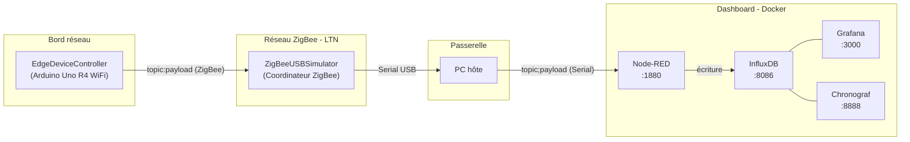

# Projet IoT — Système de gestion d'éclairage connecté

## Présentation

Ce projet met en œuvre une infrastructure IoT complète autour d'un système d'éclairage intelligent. Un objet connecté (Arduino Uno R4 WiFi) mesure la lumière ambiante et ajuste en continu la température de couleur et la luminosité d'une LED en fonction de son environnement. Il communique via un réseau ZigBee (réseau LTN, faible débit) avec une passerelle USB, qui transmet les données à une stack de visualisation déployée en Docker (Node-RED, InfluxDB, Grafana).

Le projet couvre l'ensemble de la chaîne IoT : acquisition de données sur un objet embarqué contraint, transport sur un réseau sans fil à faible consommation, ingestion en base de données de séries temporelles, et visualisation sur tableau de bord. Il inclut également une réflexion sur la sécurité de l'infrastructure.

---

## Vue d'ensemble de l'architecture



### Rôle de chaque brique

| Composant | Rôle |
|-----------|------|
| **EdgeDeviceController** | Objet connecté en bordure : lit le capteur de lumière, pilote la LED ChainableLED, synchronise l'horloge RTC, et publie la télémétrie toutes les 10 secondes via ZigBee |
| **Réseau ZigBee** | Liaison sans fil à faible débit (LTN) entre l'objet et la passerelle ; protocole pub/sub encodé en `topic:payload` dans chaque trame ZigBee |
| **ZigBeeUSBSimulator** | Coordinateur ZigBee branché en USB sur le PC hôte ; reçoit les trames des objets et les affiche sur le port série ; accepte aussi des commandes saisies en `topic;payload` pour les rediffuser sur le réseau |
| **Node-RED** | Orchestrateur de flux : lit le port série du coordinateur, parse les données, les écrit dans InfluxDB ; peut aussi servir de pont vers MQTT ou CoAP |
| **InfluxDB** | Base de données de séries temporelles ; stocke les relevés (horodatage, température couleur LED, luminosité, capteur) |
| **Grafana** | Tableau de bord de visualisation ; se connecte à InfluxDB pour afficher courbes et métriques |
| **Chronograf** | Interface d'exploration et d'administration d'InfluxDB |

---

## Arborescence du projet

```
CESI_A4_IoT/
├── README.md                          ← ce fichier
├── Packages/
│   ├── EdgeDeviceController/          ← Firmware objet connecté
│   │   ├── platformio.ini             ← Configuration PlatformIO (Uno R4 WiFi, libs)
│   │   ├── src/
│   │   │   ├── main.cpp               ← Point d'entrée : setup/loop, abonnements Cloud
│   │   │   ├── lightService.cpp       ← Logique d'adaptation de la LED
│   │   │   └── lib/
│   │   │       ├── zigBee.cpp         ← Driver ZigBee + classe Cloud (pub/sub)
│   │   │       ├── led.cpp            ← Contrôle ChainableLED
│   │   │       ├── clock.cpp          ← RTC DS1307 + classe Datetime
│   │   │       ├── lightSensor.cpp    ← Lecture capteur analogique (A0)
│   │   │       ├── switchButton.cpp   ← Gestion bouton avec debounce
│   │   │       └── debug.cpp          ← Utilitaires de débogage série
│   │   ├── include/
│   │   │   ├── constants.h            ← Toutes les constantes matérielles
│   │   │   ├── main.h                 ← Includes globaux
│   │   │   ├── lightService.h
│   │   │   ├── lib/                   ← En-têtes des drivers
│   │   │   └── utils/
│   │   │       └── float.h / float.cpp ← Utilitaires float (mapFloat, ulltoa)
│   │   └── lib/                       ← Dossier bibliothèques PlatformIO
│   │
│   ├── ZigBeeUSBSimulator/            ← Firmware coordinateur ZigBee
│   │   ├── platformio.ini             ← Configuration PlatformIO (Uno R4 WiFi, xbee-arduino)
│   │   ├── README.md                  ← Documentation détaillée du coordinateur
│   │   ├── src/
│   │   │   ├── main.cpp               ← Point d'entrée coordinateur + bridge Serial
│   │   │   └── lib/
│   │   │       └── zigBee.cpp         ← Même driver ZigBee/Cloud que EdgeDeviceController
│   │   └── include/
│   │       ├── constants.h
│   │       └── lib/zigBee.h
│   │
│   ├── Dashboard/                     ← Stack Docker de collecte et visualisation
│   │   ├── docker-compose.yml         ← Composition : Node-RED, InfluxDB, Chronograf, Grafana
│   │   ├── .env                       ← Identifiants InfluxDB et Grafana
│   │   ├── nodered-storage/           ← Données persistantes Node-RED (flows, settings)
│   │   │   └── settings.js            ← Configuration runtime Node-RED
│   │   ├── grafana-provisioning/
│   │   │   ├── datasources/
│   │   │   │   └── datasource.yml     ← InfluxDB comme source de données par défaut
│   │   │   └── dashboards/
│   │   │       ├── dashboard.yml      ← Fournisseur de dashboards (dossier /provisioning)
│   │   │       └── artillery.json.example ← Exemple de dashboard Grafana
│   │   ├── influxdb-storage/          ← Volume de données InfluxDB
│   │   ├── chronograf-storage/        ← Volume de données Chronograf
│   │   └── grafana-storage/           ← Volume de données Grafana (grafana.db)
│   │
│   └── ColorSettingsTester/           ← Outil auxiliaire de calibration LED
│       ├── RGBCalculator.html         ← Calculateur interactif température/luminosité
│       └── RGBCalculator.ggb          ← Source GeoGebra du calculateur
│
└── Screenshots/                       ← Captures d'écran du projet
```

---

## Description détaillée des composants

### EdgeDeviceController — Objet connecté

**Fichiers principaux :**
- [`Packages/EdgeDeviceController/src/main.cpp`](Packages/EdgeDeviceController/src/main.cpp)
- [`Packages/EdgeDeviceController/include/constants.h`](Packages/EdgeDeviceController/include/constants.h)
- [`Packages/EdgeDeviceController/include/lib/zigBee.h`](Packages/EdgeDeviceController/include/lib/zigBee.h)

#### Matériel requis

| Composant | Broche / Interface | Rôle |
|-----------|--------------------|------|
| Arduino Uno R4 WiFi (Renesas) | — | Microcontrôleur principal |
| Module XBee (série S2/S2B/S2C) | UART2 (RX2/TX2) | Communication ZigBee |
| RTC DS1307 | I2C | Horloge temps réel |
| Capteur de luminosité (LDR/phototransistor) | `A0` | Mesure du niveau de lumière ambiante |
| LED ChainableLED (Grove) | `D4` (CLK), `D5` (DATA) | LED RGB pilotée en température de couleur |
| Bouton marche/arrêt | `D2` (OFF), `D3` (ON) | Activation/désactivation du service lumière |

La configuration complète des broches est centralisée dans [`constants.h`](Packages/EdgeDeviceController/include/constants.h) :

```cpp
#define ZIGBEE_RX_PIN     UART2_RX_PIN
#define ZIGBEE_TX_PIN     UART2_TX_PIN
#define ZIGBEE_PAN_ID     "666"
#define ZIGBEE_CHANNELS   "D5E3"   // canaux 11-26
#define BUTTON_OFF_PIN    D2
#define BUTTON_ON_PIN     D3
#define LIGHT_SENSOR_PIN  A0
#define LED_CLK_PIN       D4
#define LED_DATA_PIN      D5
```

#### Bibliothèques utilisées

Déclarées dans [`platformio.ini`](Packages/EdgeDeviceController/platformio.ini) :

| Bibliothèque | Source | Rôle |
|--------------|--------|------|
| `xbee-arduino` | [andrewrapp/xbee-arduino](https://github.com/andrewrapp/xbee-arduino) | Driver bas niveau XBee (API mode 2) |
| `ChainableLED` | [pjpmarques/ChainableLED](https://github.com/pjpmarques/ChainableLED) | Pilotage des LED Grove chainables |
| `RTC_DS1307` | [0xybo/RTC_DS1307](https://github.com/0xybo/RTC_DS1307) | Lecture/écriture de l'horloge RTC |

#### Logique applicative

Le firmware suit une boucle à 10 ms avec un compteur d'index cyclique (0–1000) :

```
setup()
 ├── Initialisation Serial (9600 baud)
 ├── Clock::setup()          ← démarrage RTC DS1307
 ├── Led::setup()            ← initialisation ChainableLED
 ├── SwitchButton::setup()   ← configuration boutons avec debounce
 ├── ZigBee::setup()         ← configuration XBee en API mode 2, PAN 666
 ├── Cloud::setup()
 ├── Cloud::subscribe("iot/settings", …)   ← réception horodatage Unix → sync RTC
 └── Cloud::subscribe("iot/weather", …)    ← réception paramètres météo → LED

loop()  (toutes les 10 ms)
 ├── SwitchButton::loop()    ← lecture boutons, activation/désactivation LED
 ├── LightService::loop()    ← ajustement LED selon capteur lumière
 ├── ZigBee::loop()          ← lecture des trames ZigBee entrantes
 ├── Cloud::loop()
 └── (toutes les 10 s) → si configuré : Cloud::publish("iot/stats", …)
                          sinon        : Cloud::publish("iot/ask_settings", "")
```

**Service lumière (LightService) :** Le service adapte en continu la LED à la lumière ambiante. La luminosité cible est l'inverse du niveau de lumière (plus il fait sombre, plus la LED est lumineuse), et la température de couleur suit le niveau lumineux. La transition est lissée par un filtre passe-bas (coefficient 0,02) pour éviter les changements brusques.

```
luminosité LED cible  = 100 - niveau_capteur     (contrainte : 20–80 %)
température LED cible = niveau_capteur            (contrainte : 20–80 %)
valeur_suivante       = valeur_courante + (cible - valeur_courante) × 0,02
```

---

### ZigBeeUSBSimulator — Coordinateur / Passerelle

**Fichiers principaux :**
- [`Packages/ZigBeeUSBSimulator/src/main.cpp`](Packages/ZigBeeUSBSimulator/src/main.cpp)
- [`Packages/ZigBeeUSBSimulator/README.md`](Packages/ZigBeeUSBSimulator/README.md) ← documentation détaillée

Ce firmware transforme une deuxième carte Arduino Uno R4 WiFi en **coordinateur ZigBee** branché en USB sur le PC hôte. Il joue le rôle de pont bidirectionnel entre le réseau ZigBee et le PC (Node-RED, script Python, terminal…).

#### Fonctionnement

**Sens objet → PC (réception) :**

Lorsqu'une trame arrive du réseau ZigBee, le coordinateur l'affiche sur le port série selon le format :
```
iot/stats;<adresse64bits>;<payload>
iot/ask_settings;<adresse64bits>;
```

**Sens PC → objet (émission) :**

La saisie d'une commande dans le moniteur série au format `topic;payload` (terminée par `\n`) provoque la publication de la trame `topic:payload` sur le réseau ZigBee en broadcast :
```
iot/settings;1741234567        → publie iot/settings:1741234567
iot/weather;1;2                → publie iot/weather:1;2
```

**Bibliothèque utilisée :** uniquement `xbee-arduino` (voir [`platformio.ini`](Packages/ZigBeeUSBSimulator/platformio.ini)).

---

### Protocole de communication — Cloud sur ZigBee

Le projet implémente un protocole de messagerie **pub/sub minimaliste** directement dans le payload des trames ZigBee, sans couche MQTT ou CoAP. Ce choix est délibéré dans le cadre pédagogique pour comprendre les mécanismes fondamentaux avant d'utiliser une couche protocolaire standard.

#### Format des messages

```
Dans la trame ZigBee  : topic:payload
Sur le port série     : topic;payload   (entrée coordinateur)
                        topic;<addr>;<payload>   (sortie coordinateur)
```

La classe `Cloud` (dans `zigBee.h` / `zigBee.cpp`) encapsule ce mécanisme :

- `Cloud::publish(topic, payload)` → concatène `topic:payload` et envoie en broadcast ZigBee
- `Cloud::subscribe(topic, callback)` → enregistre un callback déclenché à la réception du topic
- `Cloud::deliver(sender, payload, length)` → parsé depuis `ZigBee::handleRxPacket`, distribue aux abonnés

#### Topics utilisés

| Topic | Direction | Format payload | Rôle |
|-------|-----------|----------------|------|
| `iot/settings` | Cloud → Objet | `<timestamp_unix>` | Synchronisation de l'horloge RTC |
| `iot/weather` | Cloud → Objet | `<matin>;<apres-midi>` | Paramètres de luminosité selon l'heure |
| `iot/stats` | Objet → Cloud | `<timestamp>;<temp_couleur>;<luminosité>;<capteur>` | Télémétrie toutes les 10 s |
| `iot/ask_settings` | Objet → Cloud | *(vide)* | Demande de configuration initiale |

**Exemple de trame `iot/stats` :**
```
iot/stats:1741234567;42;65;78
          ↑timestamp  ↑LED temp (%) ↑LED bright (%) ↑capteur lumière (%)
```

#### Analogie avec MQTT

| MQTT | Ce projet |
|------|-----------|
| Broker MQTT | Broadcast ZigBee (pas de point central) |
| `PUBLISH topic payload` | `Cloud::publish("iot/stats", "…")` |
| `SUBSCRIBE topic` | `Cloud::subscribe("iot/stats", callback)` |
| QoS 0 (fire & forget) | Pas d'accusé de réception applicatif |
| Payload binaire ou texte | Payload texte délimité par `;` |

La principale différence : MQTT centralise les messages sur un broker ; ici, le broadcast ZigBee joue ce rôle de diffusion, sans garantie d'ordre ni de livraison.

---

### Dashboard — Stack Docker

**Fichier de composition :** [`Packages/Dashboard/docker-compose.yml`](Packages/Dashboard/docker-compose.yml)

#### Services déployés

| Service | Image Docker | Port | Rôle |
|---------|-------------|------|------|
| **Node-RED** | `nodered/node-red:latest` | `1880` | Orchestrateur de flux : connexion Serial, parsing, écriture InfluxDB |
| **InfluxDB** | `influxdb:latest` | `8086` | Base de données de séries temporelles (base `db0`) |
| **Chronograf** | `chronograf:latest` | `8888` (localhost) | Interface d'exploration et d'administration InfluxDB |
| **Grafana** | `grafana/grafana:latest` | `3000` | Tableau de bord de visualisation |

Les données sont persistées dans des volumes locaux (`influxdb-storage/`, `chronograf-storage/`, `grafana-storage/`, `nodered-storage/`).

#### Configuration

Les identifiants sont définis dans [`Packages/Dashboard/.env`](Packages/Dashboard/.env) :

```env
INFLUXDB_USERNAME=admin
INFLUXDB_PASSWORD=admin
GRAFANA_USERNAME=admin
GRAFANA_PASSWORD=admin
```

> **Important :** modifier ces identifiants avant tout déploiement en environnement non-isolé.

**Provisionnement automatique de Grafana :**

Au démarrage, Grafana charge automatiquement :
- La source de données InfluxDB → [`grafana-provisioning/datasources/datasource.yml`](Packages/Dashboard/grafana-provisioning/datasources/datasource.yml)
- Les dashboards JSON déposés dans → [`grafana-provisioning/dashboards/`](Packages/Dashboard/grafana-provisioning/dashboards/) (exemple fourni : `artillery.json.example`)

**Flux de données attendu dans Node-RED :**

```
[Serial In (coordinateur)] → [Function: parser "iot/stats;<addr>;<data>"]
                           → [Split ";" → timestamp, temp, brightness, sensor]
                           → [InfluxDB Out (base db0, measurement "lumière")]
```

> Le dépôt ne contient pas de flows Node-RED préconfigurés. Ils sont à créer dans l'interface Node-RED selon l'usage (monitoring, alertes, etc.).

---

### ColorSettingsTester — Outil de calibration LED

**Fichiers :** [`Packages/ColorSettingsTester/RGBCalculator.html`](Packages/ColorSettingsTester/RGBCalculator.html), `RGBCalculator.ggb`

Outil HTML autonome (ouvrir dans un navigateur) permettant de visualiser en temps réel la couleur produite par une LED en fonction de :
- La **température de couleur** (en Kelvin, de 2500 K chaud à 6500 K froid)
- La **luminosité** (en %, de 0 à 100)

Il affiche les composantes R, G, B résultantes et un spectrum de couleurs avec curseurs. Cet outil a servi à définir et calibrer l'algorithme de conversion utilisé dans la classe `Led` de l'EdgeDeviceController.

---

## Technologies utilisées

### Réseaux et communication

#### ZigBee — Réseau LTN (Low Throughput Network)

ZigBee est un protocole de communication sans fil basé sur le standard IEEE 802.15.4, conçu pour les réseaux de capteurs à faible consommation d'énergie. Il fait partie de la famille des **LTN (Low Throughput Network)** et des **LPWAN** courte portée.

| Caractéristique | Valeur |
|----------------|--------|
| Fréquence | 2,4 GHz (mondial) |
| Débit | 250 kbps maximum |
| Portée | 10–100 m (intérieur) |
| Topologie | Maillage (mesh), étoile, arbre |
| Consommation | Très faible (sleep modes) |
| Adressage | 64 bits (IEEE) + 16 bits (réseau) |
| PAN ID | Identifiant de réseau (ici : `666`) |

Dans ce projet, ZigBee est utilisé en **API mode 2** (échappement des octets spéciaux) via la bibliothèque `xbee-arduino`. Le réseau est configuré en topologie broadcast : l'objet diffuse ses données vers tous les nœuds, le coordinateur reçoit et retransmet.

**Comparaison dans la taxonomie LTN/LPWAN :**

| Technologie | Portée | Débit | Consommation | Cas d'usage typique |
|-------------|--------|-------|--------------|---------------------|
| ZigBee | ~100 m | 250 kbps | Très faible | Domotique, capteurs intérieur |
| LoRa/LoRaWAN | ~10 km | 0,3–50 kbps | Très faible | Smart city, agriculture |
| Sigfox | ~40 km | 100–600 bps | Très faible | Compteurs, trackers |
| NB-IoT | ~10 km | ~60 kbps | Faible | Smart metering, mobilité |
| Wi-Fi | ~50 m | 54–600 Mbps | Élevée | Passerelles, caméras |

#### Protocoles de communication IoT

**MQTT (Message Queuing Telemetry Transport) :**
Protocole de messagerie pub/sub léger basé sur TCP/IP, standard de facto pour l'IoT. Un broker central (ex. Mosquitto, HiveMQ) redistribue les messages aux abonnés. Contrairement au projet, MQTT offre plusieurs niveaux de QoS (0, 1, 2) et une gestion des sessions persistantes. Il serait naturellement intégrable dans ce projet via Node-RED (nœud MQTT in/out).

**CoAP (Constrained Application Protocol) :**
Protocole de type REST sur UDP, conçu pour les objets très contraints (RFC 7252). Adapté quand l'objet doit exposer des ressources (GET/POST/PUT) à la demande plutôt que publier en continu. Node-RED dispose de nœuds CoAP permettant d'étendre ce projet.

**Ce projet :** protocole pub/sub minimaliste encodé dans le payload ZigBee, sans broker, sans QoS, sans reconnexion automatique. Choix pertinent pour illustrer les fondamentaux et les contraintes d'un réseau LTN embarqué.

### Matériel

| Composant | Spécification |
|-----------|--------------|
| **Arduino Uno R4 WiFi** | MCU Renesas RA4M1 (ARM Cortex-M4, 48 MHz, 32 KB RAM, 256 KB Flash), WiFi intégré (non utilisé ici) |
| **Module XBee** | Série S2C ZigBee, firmware coordinateur ou routeur, API mode 2 |
| **RTC DS1307** | Horloge temps réel I2C, précision ±2 s/jour, sauvegarde sur pile CR2032 |
| **LED ChainableLED** | LED RGB Grove (P9813), protocole série propriétaire 2 fils (CLK/DATA) |
| **Capteur de lumière** | LDR ou phototransistor sur entrée analogique A0 |

### Outillage logiciel

| Outil | Rôle |
|-------|------|
| **PlatformIO** (VS Code) | Compilation, téléversement, moniteur série pour les firmwares Arduino |
| **Docker / Docker Compose** | Déploiement de la stack de visualisation (Node-RED, InfluxDB, Grafana, Chronograf) |
| **XCTU** (Digi) | Configuration des modules XBee (PAN ID, API mode, canal) |

---

## Prérequis

### Matériel

- 2 × Arduino Uno R4 WiFi
- 2 × modules XBee ZigBee (S2C recommandé) + shields ou câblage
- 1 × RTC DS1307 (module breakout)
- 1 × capteur de lumière analogique
- 1 × LED ChainableLED Grove (P9813)
- 2 × boutons poussoirs
- Câbles, breadboard ou PCB

### Logiciel

- [PlatformIO](https://platformio.org/) (extension VS Code ou CLI)
- [Docker Desktop](https://www.docker.com/products/docker-desktop/) (Windows/macOS) ou Docker Engine (Linux)
- [XCTU](https://hub.digi.com/support/products/xctu/) pour configurer les modules XBee

---

## Installation et utilisation

### 1. Configuration des modules XBee

Avant le premier déploiement, configurer les deux modules XBee avec XCTU :

**Coordinateur (branché sur ZigBeeUSBSimulator) :**
```
ATID 666     ← PAN ID identique sur tous les nœuds
ATAP 2       ← API mode 2 (échappement d'octets)
ATCE 1       ← rôle Coordinateur
ATWR         ← sauvegarder en mémoire flash
```

**Routeur/End Device (branché sur EdgeDeviceController) :**
```
ATID 666
ATAP 2
ATCE 0       ← rôle Routeur ou End Device
ATWR
```

### 2. Téléversement des firmwares

Ouvrir chaque projet dans VS Code avec PlatformIO, brancher la carte concernée, puis :

```bash
# Firmware objet connecté
cd Packages/EdgeDeviceController
pio run --target upload

# Firmware coordinateur ZigBee
cd Packages/ZigBeeUSBSimulator
pio run --target upload
```

L'environnement `uno_r4_wifi` est défini dans `platformio.ini`. Si plusieurs ports série sont présents, ajouter `upload_port = COMx` (Windows) ou `upload_port = /dev/ttyUSBx` (Linux) dans `platformio.ini`.

### 3. Lancement du Dashboard

```bash
cd Packages/Dashboard

# Vérifier / modifier les identifiants
cat .env

# Démarrer la stack
docker compose up -d

# Vérifier que tous les services sont actifs
docker compose ps
```

Accès aux interfaces :

| Service | URL |
|---------|-----|
| Node-RED | [http://localhost:1880](http://localhost:1880) |
| Grafana | [http://localhost:3000](http://localhost:3000) |
| InfluxDB API | [http://localhost:8086](http://localhost:8086) |
| Chronograf | [http://127.0.0.1:8888](http://127.0.0.1:8888) |

### 4. Chaîne de données complète

**Étape 1 — Vérifier la communication ZigBee**

Brancher le coordinateur (ZigBeeUSBSimulator) en USB, ouvrir le moniteur série (9600 baud). Mettre sous tension l'EdgeDeviceController. Après quelques secondes, des messages `iot/ask_settings;<addr>;` apparaissent : le device demande sa configuration.

**Étape 2 — Envoyer la configuration au device**

Dans le moniteur série du coordinateur, saisir (suivi de Entrée) :
```
iot/settings;1741234567
```
*(remplacer par le timestamp Unix courant)*

Ensuite, optionnellement envoyer les paramètres météo :
```
iot/weather;1;2
```

Le device répond ensuite avec des trames `iot/stats` toutes les 10 secondes.

**Étape 3 — Configurer Node-RED**

Dans l'interface Node-RED ([http://localhost:1880](http://localhost:1880)) :
1. Ajouter un nœud **Serial In** pointant vers le port COM du coordinateur (9600 baud)
2. Ajouter un nœud **Function** pour parser la trame `iot/stats;<addr>;<ts>;<temp>;<bright>;<sensor>`
3. Ajouter un nœud **InfluxDB Out** (base `db0`, measurement `lumiere`)
4. Déployer le flow

**Étape 4 — Visualiser dans Grafana**

Se connecter à Grafana, créer un dashboard pointant sur la source de données InfluxDB (déjà provisionnée), et construire les panels (courbes température couleur, luminosité, niveau capteur).

---

## Sécurité et considérations IoT

### État actuel

| Aspect | Situation actuelle | Risque |
|--------|-------------------|--------|
| Chiffrement ZigBee | Désactivé | Les trames sont lisibles par tout récepteur ZigBee sur le même canal |
| PAN ID | Valeur par défaut (`666`) | Facilement devinable ; tout coordinateur peut rejoindre le réseau |
| Authentification | Aucune | N'importe quel émetteur ZigBee peut publier des topics |
| Identifiants Dashboard | `admin/admin` par défaut dans `.env` | Accès non autorisé si le Dashboard est exposé sur le réseau |
| Données en transit | Texte clair | Timestamp, niveaux de lumière, état LED lisibles en clair |

### Recommandations

**Réseau ZigBee :**
- Activer le chiffrement ZigBee (clé réseau 128 bits via ATKY dans XCTU)
- Changer le PAN ID par une valeur aléatoire non triviale
- Limiter les canaux de scan (`ZIGBEE_CHANNELS` dans `constants.h`)

**Dashboard :**
- Modifier les identifiants dans `.env` avant toute mise en production
- Ne pas exposer les ports InfluxDB (8086) et Chronograf (8888) sur un réseau public
- Configurer HTTPS sur Grafana et Node-RED pour les déploiements hors localhost

**Objet connecté :**
- Valider le format des payloads reçus avant de les appliquer (pas de validation actuellement sur `iot/settings` et `iot/weather`)
- Implémenter un mécanisme de liste blanche des adresses autorisées (adresse 64 bits de l'émetteur disponible dans le callback)

---

## Points d'attention et limitations connues

1. **Buffer non alloué dans `main.cpp` (EdgeDeviceController) :** La variable `char* timestamp` utilisée comme buffer pour `ulltoa()` à la ligne 56 n'est pas initialisée comme tableau. Il faudrait `char timestamp[32]` pour éviter un comportement indéfini. Cela peut provoquer des crashes ou des données corrompues sur le port série.

2. **Absence de flows Node-RED dans le dépôt :** Les flux de traitement des données (Serial → InfluxDB) sont à configurer manuellement. Seul le fichier de configuration runtime (`settings.js`) est versionné.

3. **Pas de QoS ni de persistance des messages :** Si l'objet émet pendant que le coordinateur est déconnecté, les trames sont perdues. Pour y remédier, envisager un buffer local sur l'objet ou l'activation du mode sleep/store-and-forward ZigBee.

4. **Version des images Docker non épinglée :** `docker-compose.yml` utilise le tag `latest` pour tous les services, ce qui peut introduire des régressions lors de mises à jour. En production, épingler des versions spécifiques.

---

## Références

- [xbee-arduino](https://github.com/andrewrapp/xbee-arduino) — Driver Arduino pour modules XBee
- [ChainableLED](https://github.com/pjpmarques/ChainableLED) — Bibliothèque pour LED Grove chainables
- [RTC_DS1307](https://github.com/0xybo/RTC_DS1307) — Bibliothèque RTC DS1307 pour Arduino
- [PlatformIO](https://platformio.org/docs) — Documentation PlatformIO
- [Node-RED](https://nodered.org/docs/) — Documentation Node-RED
- [InfluxDB 1.x](https://docs.influxdata.com/influxdb/v1/) — Documentation InfluxDB
- [Grafana](https://grafana.com/docs/) — Documentation Grafana
- [ZigBee Specification](https://zigbeealliance.org/) — Standard ZigBee Alliance
- [MQTT v3.1.1](https://docs.oasis-open.org/mqtt/mqtt/v3.1.1/mqtt-v3.1.1.html) — Spécification OASIS MQTT
- [CoAP RFC 7252](https://www.rfc-editor.org/rfc/rfc7252) — Protocole CoAP
